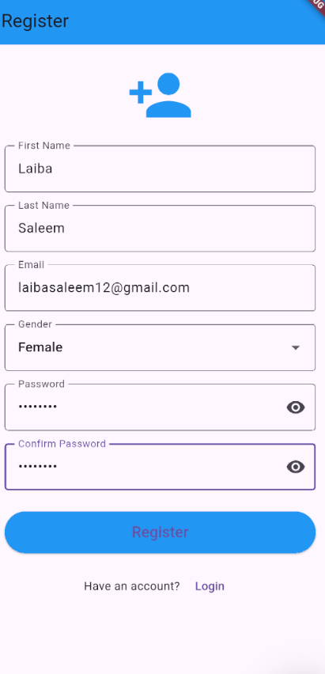
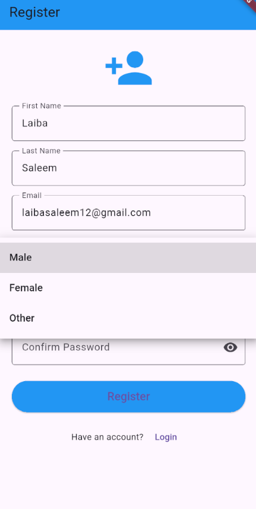
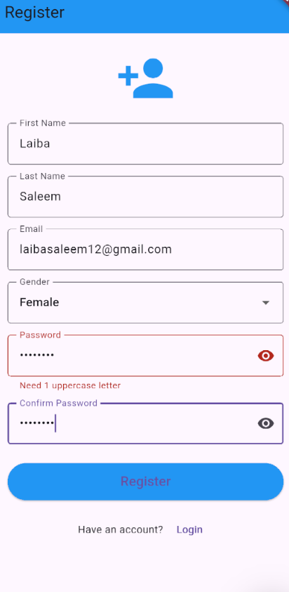
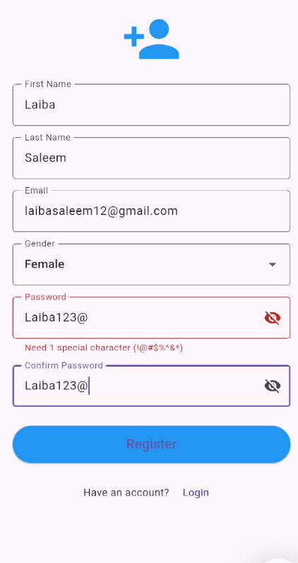
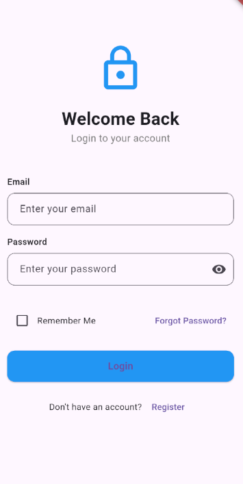
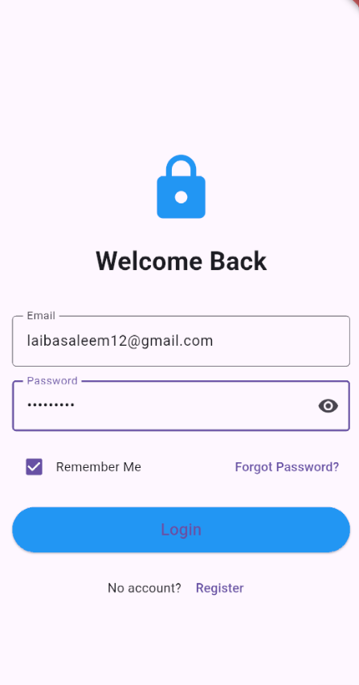
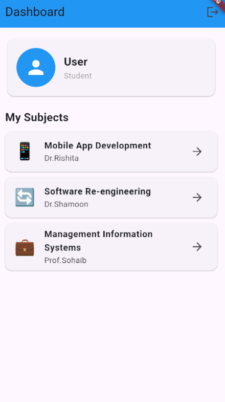
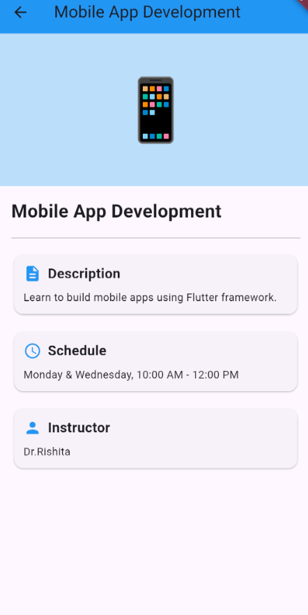
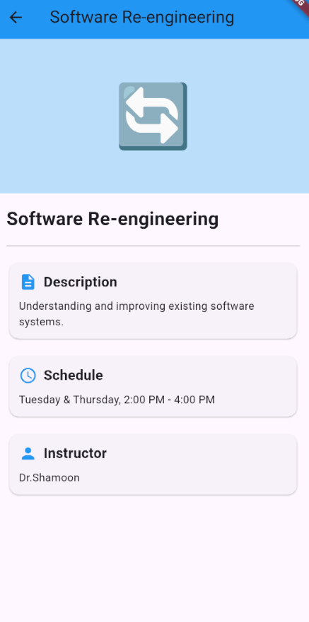
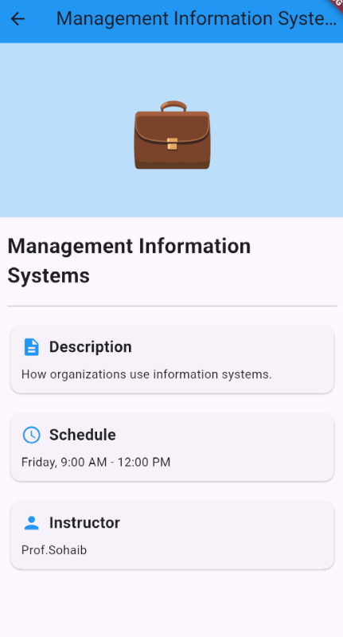

# Multi-Screen Flutter Application

## Student Information
- **Name:** Laiba Saleem
- **Student ID:** SE221017

## Screenshots

### Registration Screen





### Login Screen



### Dashboard Screen





## App Features
- User Registration with validation
- Password requirements (6+ chars, uppercase, special character)
- Login with Remember Me functionality
- Session persistence across app restarts
- Dashboard with subject list
- Subject details screen

## How to Run
```bash
flutter pub get
flutter run