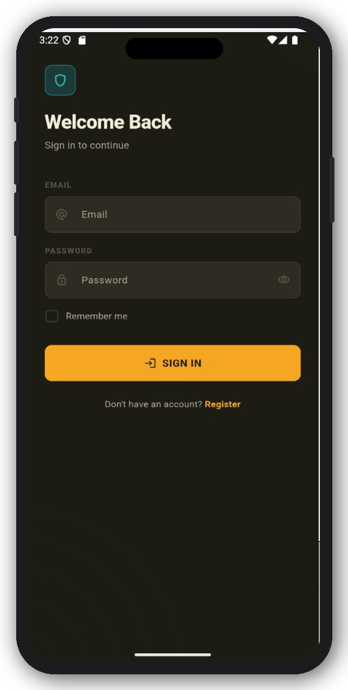
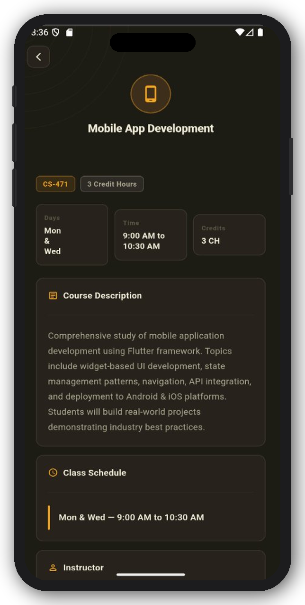
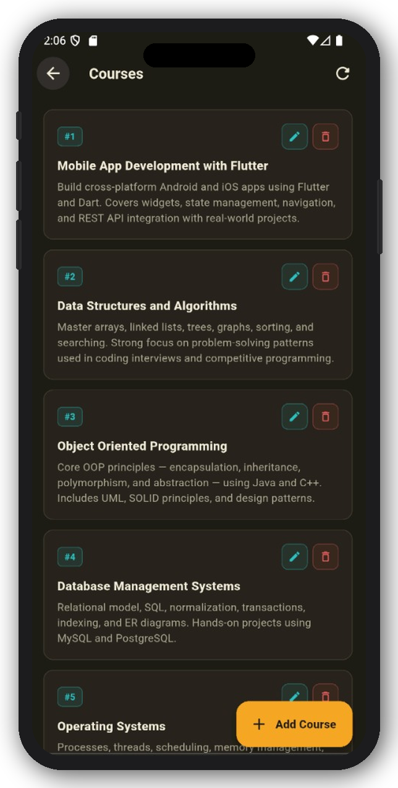
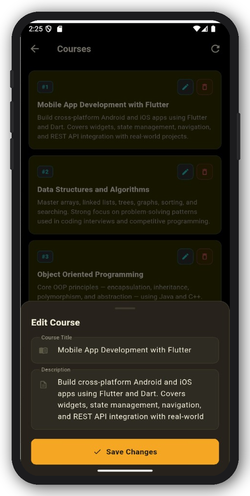
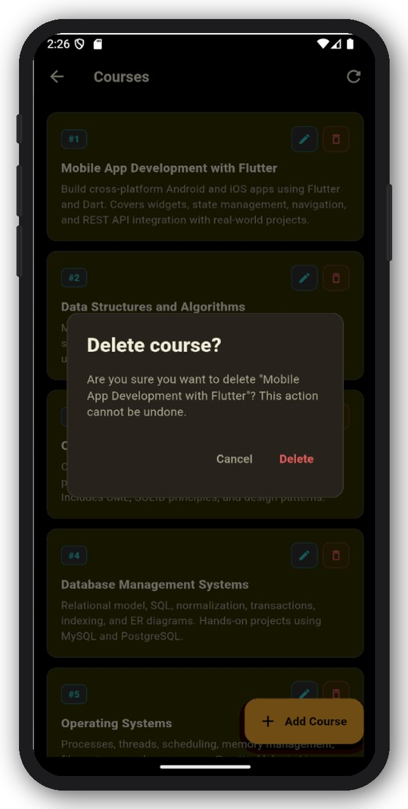

# 📱 Flutter Multi Screen App

## 👨‍💻 Student Information
- Name: Laiba Saleem
- Student_ID: SE 221017
  
## 📌 Overview
This is a modern Flutter-based Academic Management App designed for students to manage and view their academic subjects in a clean and structured interface. The application includes authentication, dashboard, and detailed subject views with a premium dark UI design.

The project is built using Flutter with Provider for state management and follows a modular and scalable architecture.

---

## 🚀 Features

- 🔐 User Registration & Login System  
- 👤 Gender Selection with Validation  
- 📊 Dynamic Dashboard with Subject List  
- 📖 Detailed Subject Information Screen  
- 🎨 Modern Dark Theme UI Design  
- ⚡ Smooth Animations & Transitions  
- 🧠 Form Validation (Email, Password, Name, etc.)  
- 💾 Remember Me Functionality (Local Storage)  
- 🧩 Reusable Custom Widgets (Buttons, Inputs, Cards)  
- 📱 Fully Responsive Mobile UI  
- 🌐 **Course CRUD with REST API Integration** *(new in this assignment)*

---

## 🛠️ Tech Stack

- Flutter (Dart)
- Provider (State Management)
- Shared Preferences (Local Storage)
- Material Design Components
- **`http` package** *(new — for REST API calls)*

---

## 📂 Project Structure

```
lib/
├── controllers/
│   └── auth_controller.dart
├── models/
│   ├── course_model.dart         ← new
│   ├── enums.dart
│   └── user_model.dart
├── screens/
│   ├── courses_screen.dart       ← new (full CRUD UI)
│   ├── dashboard_screen.dart
│   ├── detail_screen.dart
│   ├── login_screen.dart
│   └── register_screen.dart
├── services/
│   └── course_service.dart       ← new (all API calls)
├── validators/
│   └── app_validator.dart
├── widgets/
│   └── app_widgets.dart
├── app_theme.dart
└── main.dart
```

---

## 📸 Screenshots

### 🔐 Login Screen


### 📝 Registration Screen


### 📖 Subject Detail Screen


### 🆕 Courses List (CRUD — Read)


### 🆕 Add / Edit Course Form


### 🆕 Delete Confirmation Dialog


---

## 🌐 Course API Integration *(Assignment 2)*

This assignment adds a full **CRUD** Courses module backed by a real REST API,
following clean architecture with a dedicated service layer.

### 🌿 Branch
```
feature/course-api-integration
```

### API Used
**JSONPlaceholder** — a free fake REST API for testing and prototyping.

- Base URL: `https://jsonplaceholder.typicode.com`
- Resource used: `/posts` (treated as `/courses` in this app)
- Documentation: <https://jsonplaceholder.typicode.com/>
- Guide reference: <https://jsonplaceholder.typicode.com/guide/>

### Endpoints used
| Operation | Method | Endpoint            |
|-----------|--------|---------------------|
| Read      | GET    | `/posts`            |
| Create    | POST   | `/posts`            |
| Update    | PUT    | `/posts/{id}`       |
| Delete    | DELETE | `/posts/{id}`       |

> Note: JSONPlaceholder is a **fake** API — `POST`, `PUT`, and `DELETE`
> requests return successful responses but the server doesn't actually
> persist changes. This is documented behaviour. The app reflects all
> changes locally in the UI for a realistic CRUD experience.

### Documentation Followed
- JSONPlaceholder Guide: <https://jsonplaceholder.typicode.com/guide/>
- Flutter `http` package docs: <https://pub.dev/packages/http>
- Flutter networking cookbook: <https://docs.flutter.dev/cookbook/networking/fetch-data>

### CRUD Features
- **Fetch Courses (GET)** — pulls course list from API, shows title, ID, and description
- **Add Course (POST)** — modal form for creating a new course
- **Update Course (PUT)** — edit form is **pre-filled** with the existing course's data
- **Delete Course (DELETE)** — confirmation dialog before deletion
- **Loading state** — circular progress indicator while data is fetching
- **Error state** — friendly error card with a "Try Again" button
- **Empty state** — when there are no courses, shows an "Add Course" CTA
- **Success feedback** — green snackbar after add / update / delete
- **Pull-to-refresh** on the list
- **Per-row delete spinner** so the user sees which row is being removed

### Architecture Notes
- **Service layer is fully isolated.** `CourseService` is the only place
  that knows about `http`, JSON parsing, or the JSONPlaceholder URL.
- **UI never touches `http` directly.** `CoursesScreen` only calls service
  methods and handles `loading / success / error` states locally.
- **Reusable widgets** (`PrimaryButton`, `AppField`, `AmberTag`, etc.)
  are reused from the existing `app_widgets.dart`.
- **State handling:** uses the existing `AuthState { idle, loading, success, error }`
  enum from `models/enums.dart`.

### How to Run

```bash
# 1. Switch to the feature branch
git checkout feature/course-api-integration

# 2. Install dependencies
flutter pub get

# 3. Run
flutter run
```

After login, tap the **"Manage Courses"** banner on the dashboard to open
the CRUD screen.

### Submission Checklist
- [x] Branch created: `feature/course-api-integration`
- [x] CRUD: Read (GET)
- [x] CRUD: Create (POST)
- [x] CRUD: Update (PUT)
- [x] CRUD: Delete (DELETE)
- [x] Separate service layer (`lib/services/course_service.dart`)
- [x] Loading / Success / Error state handling
- [x] Delete confirmation dialog
- [x] Pre-filled update form
- [x] README updated with API + docs + branch + screenshots